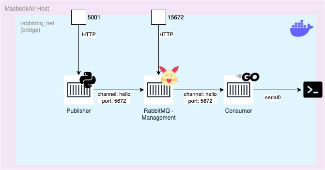

# Qué es una Message Queue

- Es una implementación del patrón de mensajería publicación/suscripción
- Es un tipo de comunicación asincrónica entre servicios
- Altamente usado en sistemas distribuidos escalables
- El objetivo principal de las message queues es permitir desarrollar sistemas debilmente acoplados

# Motivación de uso de Message Queues

## Desarrollar sistemas altamente escalables y resilentes

Mediante el patrón de arquitectura de software de microservicios

- Desarrollar aplicaciones en forma de una colección de servicios pequeños e independientes, que cumplan una única función/objetivo
- Cada microservicio puede ser desarrrollado como un proyecto de software independiente, con su propio ciclo de vida y que los cambios no afecten a los demás componentes del proyecto central
- En consecuencia, se obtienen aplicaciones resilentes y horizontalmente escalables y que ofrezcan una alta disponibilidad

# Pero...

## Dónde se encuentra la complejidad

En cómo puedo orquestar la integración entre servicios y su comunicación. Para ello existen diversas estrategias de comunicación o *patrones de mensajería*

# Messaging patterns

|Patrón|Ejemplo|
|-|-|
|*Asynchronous Request Reply|Javascript Async Await|
|Claim Check|-|
|Choreography|Procesamiento en cascada (usados en logística)|
|Competing Consumers|Procesos de streaming (basado en recompensa por volumen)|
|*Pipes and filters|Encolamiento de procesos en sistemas operativos Unix|
|Priority Queue|Sistemas de alerta|
|***Publisher-Suscriber**| ª |
|Queue-Based Load Leveling|Usado en sistemas que el thorughput es más importante que el resultado|
|Scheduler Agent Supervisor|Scheduler del Sistema Operativo|
|Sequential Convoy|FIFO|

Cada uno tiene ventajas y desventajas dependiendo del sistema a desarrollar

# Volviendo a las Message Queues (1/2)

## Ventajas

- Proveen formas de comunicación asincrónica no bloqueante entre sistemas
- Desacoplar servicios facilita la tarea de mantener y escalar sistemas
- Ofrecen fiabilidad, almacenando mensajes que deben ser entregados incluso si el receptor se encuentra temporalmente fuera de servicio
- Ofrecen flexibilidad, soportando una gran variedad de patrones de mensajería

# Volviendo a las Message Queues (2/2)

## Desventajas

- Aumentan la complejidad de los sistemas (un servicio más que mantener)
- Si no se diseña correctamente puede afectar el rendimiento general de la aplicación
- Aumentan la complejidad en el proceso de manejo de errores y la retry logic
- Disminuyen la visibilidad de cómo funciona el sistema

# Qué alternativas existen

- Remote Procedure Calls (RPC) - si no necesito que mis sistemas estén distribuidos
- HTTP APIs - si mi sistema no requiere que esté del todo desacoplado
- Usar Bases de Datos - si no es relevante la escalabilidad
- Comunicación sincrónica - bruh

# Servicios de message queue en el mercado

- *RabbitMQ* - La alternativa con mayor cuota de mercado, FOSS y altamente portable
- Apache Kafka - La alternativa con mejor rendimiento
- Amazon Simple Queue Service - La alternativa administrada de AWS basada en Apache Kafka
- *Google Cloud Pub/Sub* - La alternativa administrada de GCP basada en el protocolo AMQP
- Microsoft Azure Service Bus - La alternativa para masoquistas

# Servicios de message queue en el mercado

- *RabbitMQ* - La alternativa con mayor cuota de mercado, FOSS y altamente portable
- Apache Kafka - La alternativa con mejor rendimiento
- Amazon Simple Queue Service - La alternativa administrada de AWS basada en Apache Kafka
- *Google Cloud Pub/Sub* - La alternativa administrada de GCP basada en el protocolo AMQP
- Microsoft Azure Service Bus - La alternativa administrada por Microsoft

# Google Cloud Pub/Sub frente a RabbitMQ

|Pub/Sub|RabbitMQ|
|-|-|
|Cloud Native|Self Managed|
|PAYG|Costo Controlado|
|Basado en AMQP|Basado en AMQP|
|As Is|Altamente Customizable|
|Autoescalable|-|

# Google Cloud Pub/Sub frente a RabbitMQ

## Por qué usar una solución self managed

1. Como desarrollador, espero que el ambiente de desarrollo sea idéntico al de despliegue
2. Una solución self managed me permite "perillar" las configuraciones
3. Me es más fácil trabajar con un servicio totalmente transparente que con una caja negra

# AMQP Protocol

Advanced Message Queueing Protocol, es un protocolo de código abierto de capa de aplicación de middleware orientado a mensajes. Provee un estandar de comunicación con brokers de mensajería.

## Características principales

- Soporte de message queues
- Provee
  - Direct message routing
  - Fanout message routing (ruteo de tipo suscripción)
  - Headers-based message routing (ruteo por cabeceras)

# AMQP Protocol

## Otras caracteristicas

- QoS compliant
- Error Handling
- Security
- Atomic Transactions

# RabbitMQ (1/3)

Es el message broker FOSS de tipo message queue que implementa el protocolo AQMP más usado en el mercado.

## Caracteristicas

- Altamente personalizable
- Diseñado pensando en entornos de alto rendimiento
- Altamente compatible, con soporte para: Java (Spring), .NET, Ruby, Python, PHP, Javascript (Node), Go, Rust, Swift, Objective-C, Rust, Crystal, Scala, Groovy, Grails, Clojure, C, C++, Erlang, Perl, COBOL, Haskell, entre otros...

# RabbitMQ (2/3)

## Compatibilidad Multi Plataforma

- Windows: Servicio Nativo
- Linux: De forma nativa
- Max OS: mediante canales oficiales en brew y MacPorts
- Cloud Platforms: En formato de appliance complementario de GCP Cloud Pub/Sub, Azure Event Hub, AWS MQ.
- Contenedores: Como contenedor en plataformas de contenerización (docker, containerd, podmam)
- Orquestador de contenedores: Como cluster de contenedores en sistemas de orquestación como Kubernetes, Openshift, Docker Swarm

# RabbitMQ (3/3)

## Gran cantidad de complementos oficiales

- Complemento de monitoreo
- Complemento de administración web
- Complemento de visualización (Grafana + Prometheus)
- Complemento de endpoint API
- Complemento de ACL y IAM

# Demo

# Arquitectura de alto nivel

